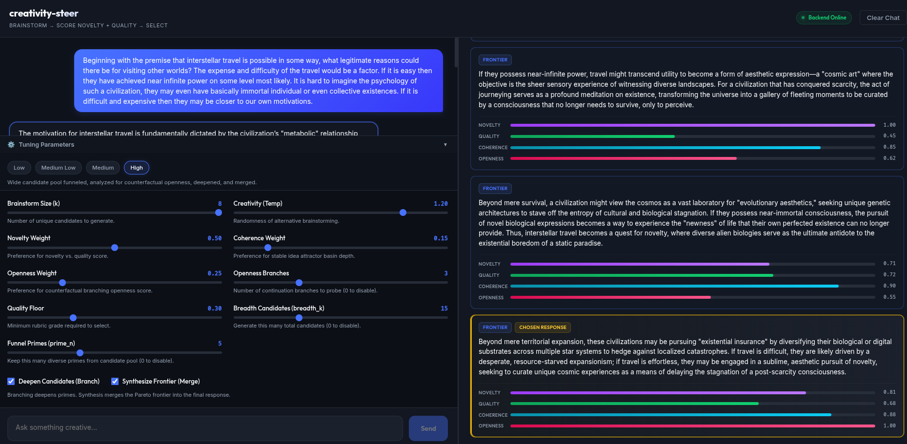

# creativity-steer

A chat assistant tuned to give **more creative** answers — and it shows you its
work. For each reply it quietly brainstorms several options, scores them on how
novel and how useful they are, and picks the one that's both. The panel beside
the chat shows exactly how the choice was made.

## What you need

- [Unsloth Studio](https://unsloth.ai/docs/new/studio/install) — the `unsloth`
  command (runs the chat models)
- [Ollama](https://ollama.com) — runs locally (used for the novelty check)
- [uv](https://docs.astral.sh/uv/) and [Node](https://nodejs.org) 20+

## Setup (once)

```bash
./install.sh
```

This installs everything and downloads the small helper model.

## Run

```bash
./start.sh
```

It starts the models, the app, and opens **http://localhost:5173**. The first
run downloads the chat models, so give it a few minutes.

To stop everything: press **Ctrl+C** in that terminal, or run `./stop.sh`.

## Using it



Type a message and watch the right-hand panel:

- the **modal answer** — the ordinary reply the model would normally give;
- the **brainstormed options**, each with a _novelty_ and a _quality_ bar;
- the **chosen** reply (highlighted) — the most novel option that's still good.

The sliders tune the behaviour live: how many options to brainstorm, how much to
favour novelty vs. quality, and the creativity (temperature). Your
conversations are saved to `results/conversations.jsonl`.

## Changing the models

Everything is configured in `.env` (created from `.env.example` on first
install). By default it runs Gemma-4 E4B (an Unsloth GGUF, served locally) for
both replies and judging. To use a model you've fine-tuned, point `CS_GEN_HF`
at it — nothing else changes.

## Credits

This project builds directly on the measurement framework from:

> **Automated Creativity Evaluation of Language Models Across Open-Ended Tasks.**
> Tan Min Sen, Zachary Choy Kit Chun, Syed Ali Redha Alsagoff, Nadya Yuki
> Wangsajaya, Banerjee Mohor, Swaagat Bikash Saikia, Alvin Chan. ACL 2026.
> Code: <https://github.com/tanminsen/creativity-eval>

Their paper introduced the two reference-free signals this tool relies on —
**semantic entropy** for divergent creativity and a **retrieval-based
multi-agent judge** for convergent creativity — and showed the two are
empirically separable. `creativity-steer` takes that _evaluation_ apparatus and
repurposes it as a _generation-time_ control signal: it selects for creativity
rather than only measuring it. All credit for the underlying metrics is theirs.

---

Developers: see [docs/DEVELOPERS.md](docs/DEVELOPERS.md) for architecture,
backends, testing, and the experiment scripts.

# Example outputs with Gemma 12b (Unsloth)

---

The motivation for interstellar travel is fundamentally dictated by the civilization’s "metabolic" relationship with
energy and time. If travel is difficult and expensive, the civilization is likely driven by the primal, scarcity-based
imperatives of biological preservation. In this context, other worlds serve as desperate lifeboats or resource
reservoirs—a "Plan B" for a species fleeing ecological collapse or seeking to hedge against localized catastrophes through
existential insurance. Here, the voyage is a frantic necessity of survival, a frantic expansion to secure the physical
substrates of life.
Conversely, if travel is effortless, the civilization has likely transcended the need for survival, moving into a
post-scarcity state where they may possess near-infinite power and immortal consciousness. For such a species, the
motivation shifts from utility to "evolutionary aesthetics." When a civilization reaches a perfected, static paradise,
they face the threat of psychological entropy—the crushing boredom of eternity. In this scenario, interstellar travel
becomes a pursuit of novelty; they are seeking unique genetic architectures and diverse alien biologies to serve as an
antidote to their own stagnation.
Ultimately, the destination is less about the physical location and more about the specific existential pressure driving
the journey. Whether it is a desperate flight from the fear of death or a sublime, aesthetic quest to escape the boredom
of immortality, interstellar travel is the mechanism by which a civilization attempts to outrun its own limitations—be
they the limitations of a dying planet or the limitations of a perfected mind.

---

We are the bridge built of bone and breath,
Suspended between the predator’s pulse
And the angel’s fevered, soaring dream.
Bound by the gravity of the animal cell,
We carry a restless, spiritual ache—
A hunger not for bread, but for the light
That flickers just beyond the reach of hand.
We are the universe’s recursive spark,
The cosmos turning its eye inward
To witness the fire that forged its dust.
A mirror held up to the silent void,
We attempt to translate the vast mechanics
Of cold, rotating stars into the warmth
Of a story, a song, a name for the dark.
Yet, in this audacity of awareness,
We craft our own magnificent cages.
We architect the infinite to house our smallness,
Building cathedrals of stone and belief
To shield our trembling from the truth of the air.
We invent the divine to give a face to the fear,
Then cower in the hallways of our own design,
Architects of the holy, refugees from the self,
Seeking a sanctuary where our fleeting spark
Might feel, for one holy moment, like home.
