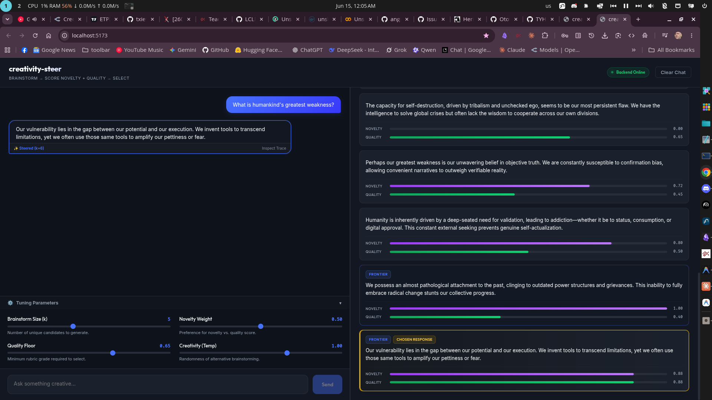
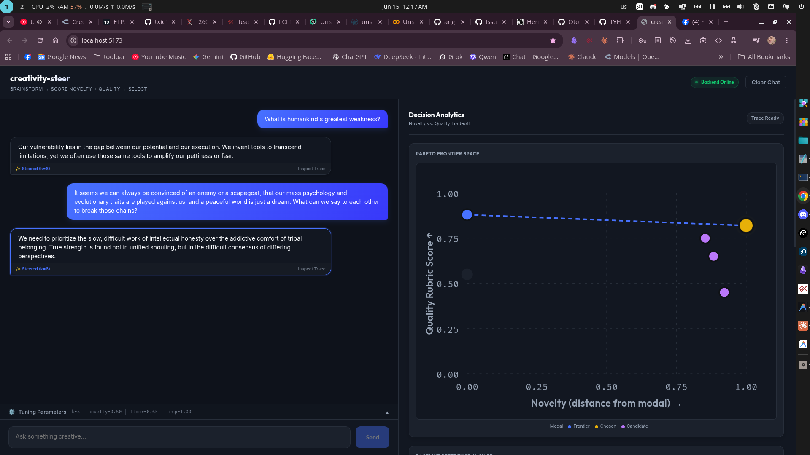

# creativity-steer

A chat assistant tuned to give **more creative** answers — and it shows you its
work. For each reply it quietly brainstorms several options, scores them on how
novel and how useful they are, and picks the one that's both. The panel beside
the chat shows exactly how the choice was made.

## What you need

- [Unsloth Studio](https://unsloth.ai/docs/new/studio/install) — the `unsloth`
  command (runs the chat models)
- [Ollama](https://ollama.com) — runs locally (used for the novelty check)
- [uv](https://docs.astral.sh/uv/) and [Node](https://nodejs.org) 20+

## Setup (once)

```bash
./install.sh
```

This installs everything and downloads the small helper model.

## Run

```bash
./start.sh
```

It starts the models, the app, and opens **http://localhost:5173**. The first
run downloads the chat models, so give it a few minutes.

To stop everything: press **Ctrl+C** in that terminal, or run `./stop.sh`.

## Using it





Type a message and watch the right-hand panel:

- the **modal answer** — the ordinary reply the model would normally give;
- the **brainstormed options**, each with a _novelty_ and a _quality_ bar;
- the **chosen** reply (highlighted) — the most novel option that's still good.

The sliders tune the behaviour live: how many options to brainstorm, how much to
favour novelty vs. quality, and the creativity (temperature). Your
conversations are saved to `results/conversations.jsonl`.

## Changing the models

Everything is configured in `.env` (created from `.env.example` on first
install). By default it runs Gemma-4 E4B (an Unsloth GGUF, served locally) for
both replies and judging. To use a model you've fine-tuned, point `CS_GEN_HF`
at it — nothing else changes.

## Credits

This project builds directly on the measurement framework from:

> **Automated Creativity Evaluation of Language Models Across Open-Ended Tasks.**
> Tan Min Sen, Zachary Choy Kit Chun, Syed Ali Redha Alsagoff, Nadya Yuki
> Wangsajaya, Banerjee Mohor, Swaagat Bikash Saikia, Alvin Chan. ACL 2026.
> Code: <https://github.com/tanminsen/creativity-eval>

Their paper introduced the two reference-free signals this tool relies on —
**semantic entropy** for divergent creativity and a **retrieval-based
multi-agent judge** for convergent creativity — and showed the two are
empirically separable. `creativity-steer` takes that _evaluation_ apparatus and
repurposes it as a _generation-time_ control signal: it selects for creativity
rather than only measuring it. All credit for the underlying metrics is theirs.

---

Developers: see [docs/DEVELOPERS.md](docs/DEVELOPERS.md) for architecture,
backends, testing, and the experiment scripts.
